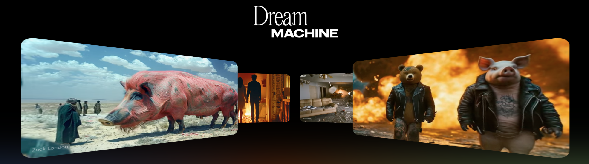

---
hide:
  - navigation
  - toc
---

# [Jiaming Song](https://tsong.me/){:target="_blank"}
## Dream Machine: Emergent Capabilities from Video Foundation Models
### Chief Scientist at Luma AI November 27, 2024 (Wed), 1:00 p.m. KST Online (Zoom).

### <b>Guest Lecture at [CS492(D): Diffusion Models and Their Applications](../){:target="_blank"} [Minhyuk Sung](http://mhsung.github.io/){:target="_blank"}, [KAIST](https://www.kaist.ac.kr/){:target="_blank"}, Fall 2024</b>

 
[Recording]({{links.guest_rec2}}){:target="_blank" .md-button}

 
{ width=99% }[^1]

[^1]: Image from https://lumalabs.ai/dream-machine.  

### **Abstract**
Dream Machine is a new video generative foundation model developed by Luma AI. We will show how Dream Machine exhibits some emergent capabilities that relate to vision, such as depth, segmentation, light transport, dynamics, and causality. Given the observations, we argue that learning from videos is a promising path for 3D/4D generation and "world models".

### **Bio**
Jiaming Song is the Chief Scientist in Luma AI, where he is working on next-generation multimodal foundation models. He received his Ph.D. at Stanford University, under the supervision of Stefano Ermon. He has developed a few early works on diffusion models, such as DDIM and SDEdit. He is the recipient of the ICLR 2022 Outstanding Paper Award.

 

