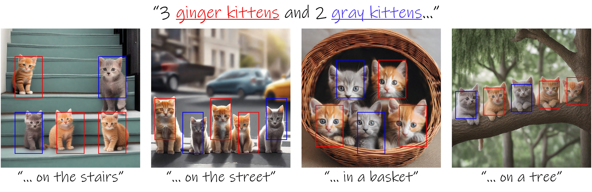

---
hide:
  - navigation
  - toc
---

# [Or Patashnik](https://orpatashnik.github.io/){:target="_blank"}
## On Attention Layers for Image Generation and Manipulation
### Ph.D. Student at Tel-Aviv University October 10, 2024 (Thu), 4:00 p.m. KST Online (Zoom).

### <b>Guest Lecture at [CS492(D): Diffusion Models and Their Applications](../){:target="_blank"} [Minhyuk Sung](http://mhsung.github.io/){:target="_blank"}, [KAIST](https://www.kaist.ac.kr/){:target="_blank"}, Fall 2024</b>

 
[Recording]({{links.guest_rec1}}){:target="_blank" .md-button}

{ width=99% }[^1]

[^1]: Image from Dahary et al., Be Yourself: Bounded Attention for Multi-Subject Text-to-Image Generation
, ECCV 2024.  

### **Abstract**
In this talk, we will explore the role of attention layers in generative models and the diverse applications they enable. We will examine how the semantic correspondences facilitated by these layers allow for image manipulation and consistent image generation. However, we will also address the challenges that arise, particularly in scenarios involving complex prompts with multiple subjects. Our analysis will highlight issues such as semantic leakage during the denoising process, which can lead to inaccurate representations. By examining both the capabilities and challenges of attention layers, this talk aims to provide a comprehensive understanding of their power and potential within generative models.

### **Bio**
Or Patashnik is a Computer Science PhD student at Tel-Aviv University, under the supervision of Prof. Daniel Cohen-Or. She is interested in computer graphics, computer vision, and machine learning. Specifically, she works on projects that involve image generation and manipulation.

 

