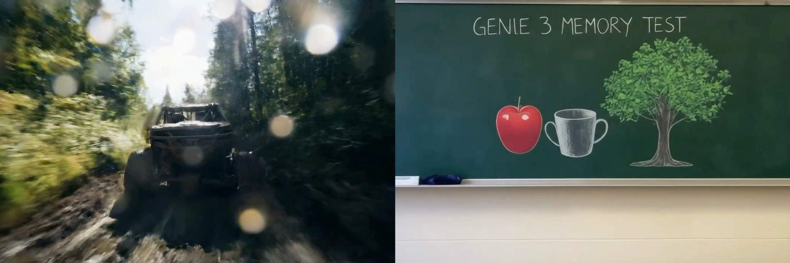

---
hide:
  - navigation
  - toc
---

# [Philipp Henzler](https://henzler.github.io/){:target="_blank"}
## Generative 3D Content Creation
### Research Scientist at Google November 26, 2025 (Wed), 10:30 a.m. KST Online (Zoom).

### <b>Guest Lecture at [CS492(C): Diffusion and Flow Models](../){:target="_blank"} [Minhyuk Sung](http://mhsung.github.io/){:target="_blank"}, [KAIST](https://www.kaist.ac.kr/){:target="_blank"}, Fall 2025</b>

 
[Zoom Link]({{links.zoom}}){:target="_blank" .md-button}
[Google Calendar Link](https://calendar.google.com/calendar/event?action=TEMPLATE&tmeid=NWR0YWJmN2dxdnExMGlranFibWFiNWlqNjUgamhvMGR0bDBwczVjaWl2ZmxqOXJ0NmU0cWtAZw&tmsrc=jho0dtl0ps5ciivflj9rt6e4qk%40group.calendar.google.com){:target="_blank" .md-button}

<!--
[Recording]({{links.guest_rec1}}){:target="_blank" .md-button}
-->

{ width=99% }

### **Abstract**
While video models like Veo and Sora have achieved photorealism and interactivity (e.g., Genie), their high inference costs pose significant challenges for efficient deployment. To address this, we turn to explicit 3D representations as a more efficient medium for serving. In this talk, I will show how we can effectively distill the priors of 2D generative models into consistent 3D representations.

### **Bio**
Philipp Henzler is a Research Scientist at Google working on controllable video models (Veo) and generative 3D AI. He received his PhD from University College London supervised by Tobias Ritschel and Niloy J. Mitra. His PhD thesis received the Eurographics PhD Thesis award 2024. He received his BSc and MSc from Ulm University.

 

