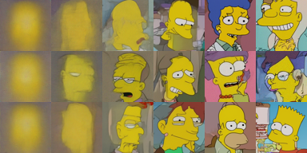

---
hide:
  - navigation
---

# CS492(C): Diffusion and Flow Models

<h3><b>
<a href="http://mhsung.github.io/" target="_blank">Minhyuk Sung</a>, <a href="https://www.kaist.ac.kr/" target="_blank">KAIST</a>, Fall 2025
</b></h3>

## Image Generation Challenge

^^**Mid-Term Evaluation Submission  Due**^^: ==November 2 (Sunday), 23:59 KST==  
^^**Final Submission Due**^^: ==November 15 (Saturday), 23:59 KST==  
^^**Where to submit**^^: ==KLMS==  

[Introduction Slides]({{links.image_gen_slides}}){:target="_blank" .md-button}

### What to Do
In this challenge, your task is to train an **image diffusion/flow model** beyond the previous 2D toy experiment setups from the assignments. After training, you are encouraged to explore and apply any techniques you find effective for achieving **high-quality generation** with only **a few sampling steps**.

Specifically, your tasks are as follows:

1. **Implementing a Diffusion/Flow Wrapper**
    - We provide the **architecture backbone** (which should remain fixed), but everything around it is up to you.
    - Your goal is to design and implement **your own diffusion/flow model wrapper**, including **noise schedulers** as well as the **forward and reverse processes**.  

2. **Improving Few-Step Generation**
    - Once your diffusion/flow wrapper is ready, the main challenge is to investigate and improve the generation quality with **very few sampling steps**.
    - Your models will be evaluated with **three Number of Function Evaluations (NFEs): 1, 2, and 4**.
    - You are encouraged to experiment with the latest techniques, such as Consistency Models, ReFlow, or any other advanced methods you find effective.
    - Check out the [Recommended Readings](#recommended-readings) section, but you are _not_ limited to implementing one of the algorithms introduced in those papers; they are provided only as references.

**==Important Notes==**

^^PLEASE READ THE FOLLOWING CAREFULLY! Any violation of the rules or failure to properly cite existing code, models, or papers used in the project in your write-up will result in a zero score.^^

- **DO NOT** use any pretrained diffusion model. You must train the model from scratch.  
- **DO NOT** modify the provided U-Net architecture code.  
- **DO NOT** modify the provided sampling code and evaluation script. These will be distributed to ensure consistent evaluation across all submissions.  
- You are allowed to use open-source implementations, as long as they are **clearly mentioned and cited** in your write-up.  

### Dataset and Base Code

You are required to use the [Simpsons Face](https://www.kaggle.com/datasets/kostastokis/simpsons-faces){:target="_blank"} image dataset for training and evaluation.

{ width=50% }

**You do not need to download the dataset yourself.** We will provide a script in the base code that automatically downloads the dataset.

[Base Code]({{links.image_gen_repo}}){:target="_blank" .md-button}

### Evaluation

This is a **team-based competition**. The performance of your image generative models will be evaluated quantitatively using [Fréchet Inception Distance (FID)](https://en.wikipedia.org/wiki/Fr%C3%A9chet_inception_distance){:target="_blank"} scores at Numbers of Function Evaluations (NFEs) = 1, 2, and 4.

**Final grading will be determined relative to the best FID score achieved at each NFE.** In other words, the team with the lowest (best) FID for a given NFE will set the benchmark, and other teams will be graded proportionally against that score.

The TAs will provide FID scores computed using their own implementation of diffusion and flow models as reference values (the code will not be released). You are expected to match or surpass these reference FIDs.

Additionally, to help everyone gauge progress, there will be a [Mid-Term Evaluation](#mid-term-evaluation-submission-optional){:target="_blank"}  where teams can submit intermediate results. **Participation is optional**, but the top team at each NFE in the mid-term evaluation that also outperforms the TAs’ FID scores will receive **bonus credit** toward the final grade. All submitted results will be shared anonymously with the class so that teams can see how others are performing.

### Mid-Term Evaluation Submission (Optional)
The purpose of the mid-term evaluation is to give all students a reference point for how other teams are progressing. **Participation is optional**, but the top team at each NFE in the mid-term evaluation that also outperforms the TAs’ FID scores will receive **bonus credit** toward the final grade.

- **What to submit**
    1. **Self-contained source code** 
        - Your submission must include the complete codebase necessary to run end-to-end from the TAs' side.
        - TAs will run your code in their environment without additional modifications.
        - For consistent evaluation, the files `sampling.py` and `measure_fid.py` will be replaced with the official versions.
    2. **A model checkpoint and config json file**  
- **Evaluation**
    - TAs will run your submitted code in their Python environment.
    - The FID scores measured by TAs will be published on the leaderboard.
    - Submissions that fail to run in the TA environment will be marked as failed on the leaderboard.
    - Among the submissions exceeding the TAs' result, the top-k will earn bonus credit.  

### Final Submission
- **What to submit**:
    1. **Self-contained source code** 
    2. **A model checkpoint and config json file**  
    3. **2-page write-up**.
        - No template provided.  
        - Maximum of two A4 pages, excluding references.  
        - All of the following must be included:
            - **Technical details**: One-paragraph description of the technical details of your few-step generation implementation.
            - **Training details**: Training logs (e.g., training loss curves), and total training time.
            - **Qualitative evidence**: ~8 sample images from the early training phases.  
            - **Citations**: All external code, and papers used must be properly cited.
        - ^^Missing any of these items will result in a penalty.^^
        - ^^If the write-up exceeds two pages, any content beyond the second page will be ignored, which may lead to missing required items.^^

### Grading
^^**There is no late day. Submit on time.**^^  
**Late submission**: ==Zero score==.  
**Missing any required item in the final submission (samples, code/model, write-up)**: ==Zero score==.  
**Missing items in the write-up**: ==10% penalty for each==.  

### Recommended Readings
[1]  [Song et al., Consistency Models, ICML 2023.](https://arxiv.org/abs/2303.01469){:target="_blank"}  
[2]  [Kim et al., Consistency Trajectory Models: Learning Probability Flow ODE Trajectory of Diffusion, ICLR 2024.](https://arxiv.org/abs/2310.02279){:target="_blank"}  
[3]  [Liu et al., Flow Straight and Fast: Learning to Generate and Transfer Data with Rectified Flow, ICLR 2023.](https://arxiv.org/abs/2209.03003){:target="_blank"}  
[4]  [Frans et al., One Step Diffusion via Shortcut Models, ICLR 2025.](https://arxiv.org/abs/2410.12557){:target="_blank"}  
[5]  [Tong et al., Learning to Discretize Denoising Diffusion ODEs, ICLR 2025.](https://arxiv.org/abs/2405.15506){:target="_blank"}  

 

[Back to top](#)
 

