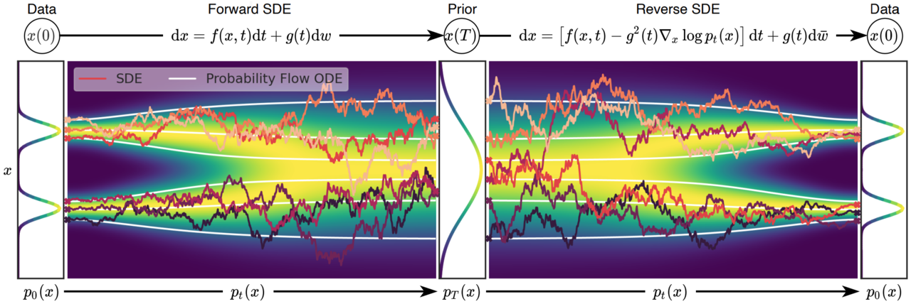

---
hide:
  - navigation
---

# CS492(C): Diffusion and Flow Models

<h3><b>
<a href="http://mhsung.github.io/" target="_blank">Minhyuk Sung</a>, <a href="https://www.kaist.ac.kr/" target="_blank">KAIST</a>, Fall 2025
</b></h3>
 

{ width=97.5% }[^1]

[^1]: Teaser image credits: Song et al., Score-Based Generative Modeling through Stochastic Differential Equations, ICLR 2021. 

## Time & Location
**Time**: Mon/Wed 10:30 a.m. - 11:45 a.m. (KST)   
**Location**: E3-5 Rm 210.

<!-- [Zoom Link](https://kaist.zoom.us/j/83695846631){:target="_blank" .md-button} -->

## Description
Recent breakthroughs in generative AI have amazed people with the unprecedented quality of generated images and videos, as exemplified by SORA, Midjourney, StableDiffusion, and many others. These advancements have been achieved using diffusion models, which have become the new standard technique for generative models. Diffusion models offer numerous advantages, including superior performance in the quality of generated outputs, as well as capabilities in conditional generation, personalization, zero-shot manipulation, and knowledge distillation.

In this course, we will discuss the theoretical foundations and practical applications of diffusion models. While the goal is to cover both theory and practice, the focus will be on gaining hands-on experience by implementing diffusion model techniques in programming assignments and solving real-world problems in the course project. 

## Prerequisites
- Solid background in machine learning and deep learning
- Hands-on experience with neural network implementation
- Recommended prior courses:
    - MAS.20050 Probability and Statistics
    - MAS.20001 Differential Equations and Applications
    - CS.30701 Introduction to Deep Learning

## Course Staff
**Instructor**: [Minhyuk Sung](https://mhsung.github.io/){:target="_blank"} ([mhsung@kaist.ac.kr](mailto:mhsung@kaist.ac.kr))

**Course Assistants:**

- Juil Koo ([63days@kaist.ac.kr](mailto:63days@kaist.ac.kr))
- Seungwoo Yoo ([dreamy1534@kaist.ac.kr](mailto:dreamy1534@kaist.ac.kr))
- Yuseung Lee ([phillip0701@kaist.ac.kr](mailto:phillip0701@kaist.ac.kr))
- Yunhong Min ([dbsghd363@kaist.ac.kr](mailto:dbsghd363@kaist.ac.kr))

## Past Years
- [CS492(D): Diffusion Models and Their Applications](https://mhsung.github.io/kaist-cs492d-fall-2024/){:target="_blank"}

## Grading
- In-Class Participation: 10%
- In-Class Tests: 20%
- Programming Assignments: 20%
- Image Generation Challenge: 25%
- Visual Content Creation Contest: 25%

<!--
## Paper List

[Paper List](https://docs.google.com/spreadsheets/d/1j7amDru9bRQsQgp2pfm1a8GrZ6K0HWwCDORGq-sj7dQ/edit?usp=sharing){:target="_blank" .md-button}
-->

## Useful Resources
- [Fall 2024 Course Webpage](https://mhsung.github.io/kaist-cs492d-fall-2024/){:target="_blank"}
- [SIGGRAPH 2025 Course: Diffusion Models for Image and Video Generation: From Foundations to Emerging Directions](https://geometry.cs.ucl.ac.uk/courses/diffusion_ImageVideo_sigg25/){:target="_blank"}
- [SIGGRAPH 2024 Course: Diffusion Models for Visual Content Generation](https://geometry.cs.ucl.ac.uk/courses/diffusion4ContentCreation_sigg24/){:target="_blank"}
- [CVPR 2023 Tutorial: Denoising Diffusion Models: A Generative Learning Big Bang](https://cvpr2023-tutorial-diffusion-models.github.io/){:target="_blank"}
- ["Generative Modeling by Estimating Gradients of the Data Distribution", Yang Song.](https://yang-song.net/blog/2021/score/){:target="_blank"}
- ["What are Diffusion Models?", Lilian Weng.](https://lilianweng.github.io/posts/2021-07-11-diffusion-models/){:target="_blank"}
- ["Understanding Diffusion Models: A Unified Perspective". Calvin Luo.](https://arxiv.org/abs/2208.11970){:target="_blank"}
- ["Tutorial on Diffusion Models for Imaging and Vision". Stanley H. Chan.](https://arxiv.org/abs/2403.18103){:target="_blank"}
- ["Step-by-Step Diffusion: An Elementary Tutorial". Preetum Nakkiran, Arwen Bradley, Hattie Zhou, and Madhu Advani.](https://arxiv.org/abs/2406.08929){:target="_blank"}

## Important Dates
ALL ASSIGNMENTS ARE DUE 23:59 KST.  

(Subject to Change)  

- Project Team Sign-Up: ==Due Sep 30 (Tue)==  
- 1st Programming Assignment: ==Due Sep 30 (Tue)==  
- 2nd Programming Assignment: ==Due Oct 14 (Tue)==  
- 3rd Programming Assignment: ==Due Nov 11 (Tue)==  
- Image Generation Challenge Submission: ==Due Nov 15 (Sat)== 
- Visual Content Creation Contest Submission: ==Due Dec 06 (Sat)== 

## Schedule
(Subject to Change) 

| Week | Mon | Topic | Wed | Topic |
| :----: | :----: | :----: | :----: | :----: |
| 1  | Sep 01 | __Course Introduction__ [**Slides**]({{links.lec01}}){:target="_blank"} | Sep 03 | __Introduction to Generative Models__ [**Slides**]({{links.lec02}}){:target="_blank"} [**Recording**]({{links.rec02}}){:target="_blank"} |
| 2  | Sep 08 | __DDPM 1__ [**Slides**]({{links.lec03}}){:target="_blank"} [**Recording**]({{links.rec03}}){:target="_blank"} | Sep 10 | __DDPM 2__ [**Slides**]({{links.lec04}}){:target="_blank"} |
| 3  | Sep 15 | __DDIM 1__                      | Sep 18 | ==[Assignment 1 Session]({{links.asgmt01}}){:target="_blank"}== |
| 4  | Sep 22 | __DDIM 2 / CFG / ControlNet__     | Sep 24 | __PF-ODE / DPM-Solver 1__ |
| 5  | Sep 29 |  __PF-ODE / DPM-Solver 2__       | Oct 01 | ==[Assignment 2 Session]({{links.asgmt02}}){:target="_blank"}== | 
| 6  | Oct 06 | No Class (Chuseok)              | Oct 08 | No Class (Chuseok) |
| 7  | Oct 13 |  __Flow Matching 1__            | Oct 15 | __In-Class Test 1__ |
| 8  | Oct 20 | No Class (Midterm Week)         | Oct 22 | No class (Midterm Week) |
| 9  | Oct 27 | __Flow Matching 2__             | Oct 30 | ==[Assignment 3 Session]({{links.asgmt03}}){:target="_blank"}== |
| 10 | Nov 03 | __Score Distillation__          | Nov 06 | __Inference-Time Guidance__ |
| 11 | Nov 10 | ==[Demo Session]({{links.demo}}){:target="_blank"}== | Nov 12 | No class (Break) |
| 12 | Nov 17 | __Guest Lecture 1__             | Nov 20 | __Discrete Diffusion__  |
| 13 | Nov 24 | __Guest Lecture 2__             | Nov 24 | __In-Class Test 2__ |
| 14 | Dec 01 | No Class (Conference Trip)      | Dec 04 | No Class (Conference Trip) |
| 15 | Dec 08 | Project Presentations 1         | Dec 11 | Project Presentations 2 |
| 16 | Dec 15 | No Class (Final Week)           | Dec 18 | No Class (Final Week) |

## AI Coding Assistant Tool Policy
**You are allowed (and even encouraged) to utilize AI coding assistant tools**, such as ChatGPT, Copilot, Codex, and Code Intelligence, for your programming assignments and projects. Utilizing AI coding assistant tools will not be deemed as plagiarism. However, it is still **strictly prohibited to directly copy code from the Internet or from someone else**. Doing so will lead to a score of zero and a report to the university.

 
